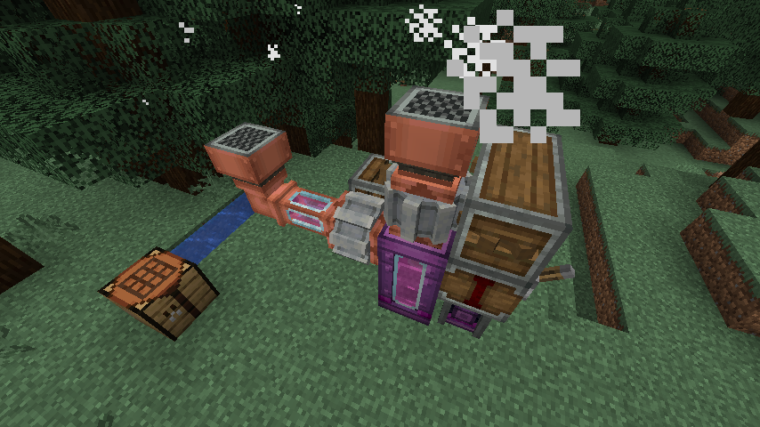
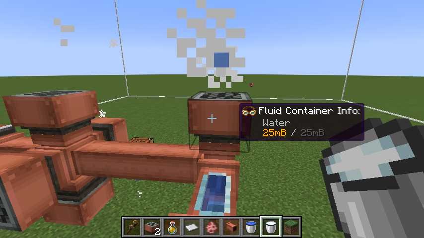
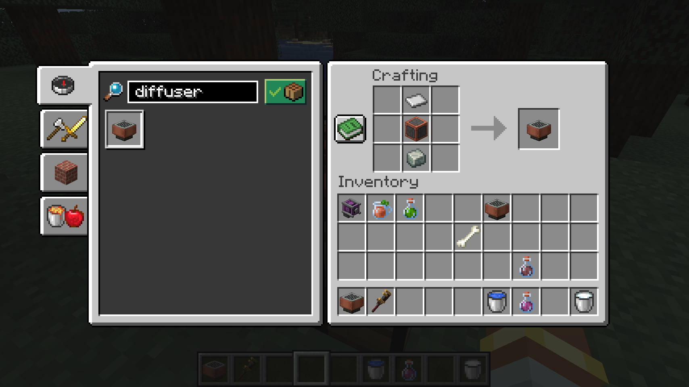

# Create Diffuser Block



This mod adds a new block to Create called the diffuser. Diffusers take in a fluid from their underside and distribute any effects that the fluid causes in an 8x8x8 area around them. Think of them as a poor man's beacon.



If you're wearing goggles, sneaking while looking at a diffuser will show you its area of effect as a bounding box.



## Adding custom fluid effects

The diffuser applies whatever fluid effects are supplied via datapack, and failing that it pulls from the effects specified in Create's `OpenPipeEffectHandler`. If you want to supply your own fluid effects, use the following JSON structure in a datapack:

```json

// file location should be data/[pack_name]/diffuser/fluid_effect/[your_fluid_effect].json

{
  "forge:conditions": [
    {
      "type": "forge:mod_loaded",
      "modid": "estrogen" // the name of a mod required. Add multiple condition objects if you need multiple mods
    }
  ],
  "fluid": "estrogen:liquid_estrogen",
  "effect": "estrogen:estrogen"
}
```

## Credits

This mod was set up using the [Forge MDK for 1.20.1](https://docs.minecraftforge.net/en/1.20.x/gettingstarted/#from-zero-to-modding). It also uses the [1.20.1 Forge Architectury Template](https://github.com/architectury/architectury-templates/releases) as a base.

Big thanks to the folks at the [Create](https://github.com/Creators-of-Create/Create) and [Estrogen](https://github.com/MayaqqDev/Estrogen) Discord servers for helping me get things working 💜